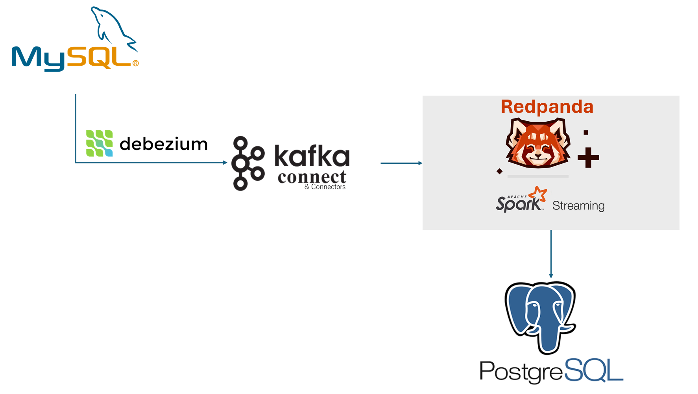
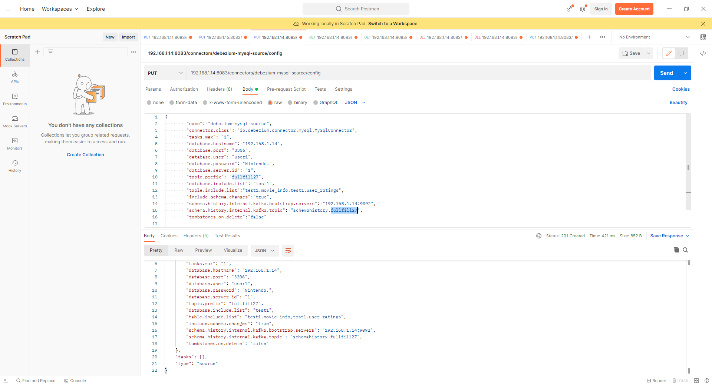
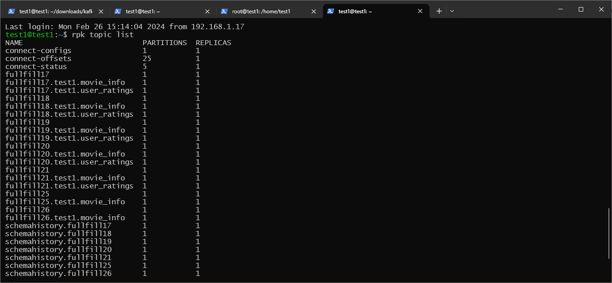
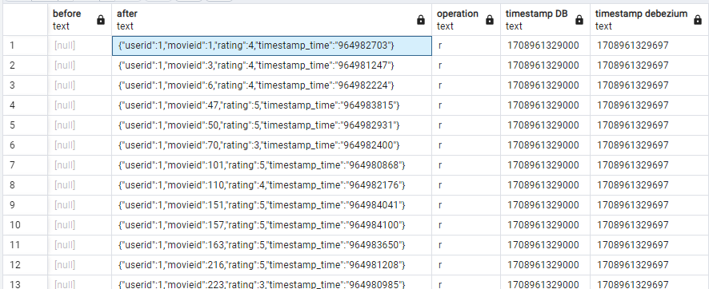

# CDC-Debezium-Redpanda MySQL to PostgreSQL
## About Project

Insall Redpanda, Kafka Connect, MySQL, Structured streaming + kafka integration guide, PostgresSQL on premise

Configure Debezium MySQL source connector

Insert, Update or Delete data from tables in database of MySQL

Consume the change data events from the Kafka topics with Spark (Structured streaming) and transform  the data into PostgresSQL

### Architecture

### Kakfa connect REST API  

Submit Debezium MySQL connector with the Kafka Connect. The following command uses the Kafka Connect service’s API to submit a POST request against the /connectors resource with a JSON document

### Redpanda
Show list topic

$ rpk topic list

###  Data in PostgreSQL database
Consume the change data events from the Kafka topics with Spark (Structured streaming) and transform  the data into PostgresSQL

